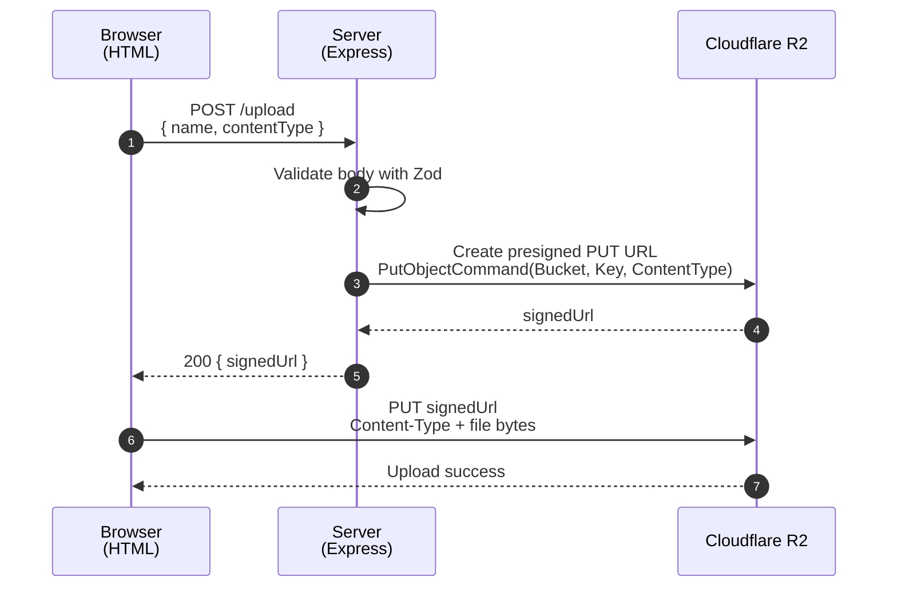

# Presigned URL Upload Sequence

```mermaid
sequenceDiagram
    autonumber
    participant Client as Browser<br/>(HTML)
    participant Server as Server<br/>(Express)
    participant R2 as Cloudflare R2

    Client->>Server: POST /upload<br/>{ name, contentType }
    Server->>Server: Validate body with Zod
    Server->>R2: Create presigned PUT URL<br/>PutObjectCommand(Bucket, Key, ContentType)
    R2-->>Server: signedUrl
    Server-->>Client: 200 { signedUrl }
    Client->>R2: PUT signedUrl<br/>Content-Type + file bytes
    R2-->>Client: Upload success
```
